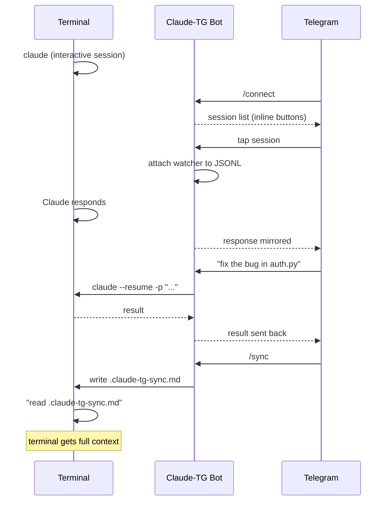

# Claude-TG

Telegram bot for remote control of [Claude Code](https://docs.anthropic.com/en/docs/claude-code) CLI sessions from your phone.

Connect to a running Claude Code terminal session via Telegram, see responses in real-time, send commands remotely, and sync context back when you return to the terminal.

## Features

- **Connect to terminal sessions** — attach to any running Claude Code session with one tap
- **Real-time response mirroring** — Claude's terminal output is forwarded to Telegram automatically
- **Remote command execution** — send prompts from Telegram, Claude executes with full permissions
- **Context sync** — transfer Telegram conversation history back to the terminal via `/sync`
- **Session management** — create, list, stop sessions from Telegram
- **Smart message routing** — replies go to the right session, inline keyboards for disambiguation
- **Auto-registration** — first `/start` auto-registers your `chat_id`
- **Prompt templates** — upload `.md`/`.txt` snippets and dispatch them with one tap
- **Session health check** — `/ping` detects hung runs and reports idle time
- **Token usage tracking** — local counter per session and across all sessions (5h/24h/all-time)
- **Auto-resume after rate limits** — queue messages when usage limit hits; bot retries automatically or notifies when the window resets
- **Auto-continue for terminal sessions** — opt-in per session; if Claude in the terminal hits a limit while you're watching from Telegram, the bot detects it in the JSONL stream and sends a continuation prompt as soon as the window resets (no prompt from you needed)
- **Self-update from GitHub** — `/update` fetches and applies new commits

## How It Works



## Quick Start

### 1. Create a Telegram Bot

Open Telegram, find [@BotFather](https://t.me/BotFather), send `/newbot`. Pick a name and username (must end with `bot`). Copy the token.

### 2. Clone and Install

```bash
git clone https://github.com/sawierro/claude-tg.git
cd claude-tg
```

**Windows:**
```
setup.bat
```

**Linux / Mac:**
```bash
chmod +x setup.sh
./setup.sh
```

The setup script creates a virtual environment, installs dependencies, and prompts for your bot token.

### 3. Set Your Owner Chat ID

The bot requires an explicit owner — **it does not auto-register the first caller any more** (security: anyone who saw your bot username could hijack it). Find your Telegram chat ID by messaging [@userinfobot](https://t.me/userinfobot), then add it to `.env`:

```
TELEGRAM_TOKEN=123456:ABC-...
OWNER_CHAT_ID=123456789
```

Multiple owners: comma-separate them (`OWNER_CHAT_ID=111,222`).

### 4. First Launch

```bash
# Windows
start.bat

# Linux / Mac
./start.sh
```

Send `/help` to your bot in Telegram to see the command list.

> ⚠️ **Read [`SECURITY.md`](SECURITY.md) before exposing the bot to anyone else.** The CLI runs with `--dangerously-skip-permissions` by default, which means bot access is equivalent to SSH access on the host.

## Usage

### Connect to a Terminal Session

1. Start `claude` in your terminal as usual
2. In Telegram, send `/connect`
3. Tap the session button to attach
4. Claude's responses now mirror to Telegram
5. Send messages to control the session remotely

### Sync Context Back to Terminal

Telegram commands create a separate conversation branch (Claude CLI limitation). To transfer context back:

1. Send `/sync` in Telegram
2. Bot writes `.claude-tg-sync.md` to the project folder
3. In terminal, tell Claude: *"read .claude-tg-sync.md"*

### Commands

| Command | Description |
|---------|-------------|
| `/connect` | List terminal sessions, attach with one tap |
| `/sync` | Write conversation summary to project folder |
| `/new <name> [path] [prompt]` | Create a new Claude session |
| `/sessions` | List active bot sessions |
| `/stop <name>` | Disconnect a session |
| `/cancel` | Kill running Claude process |
| `/ping [name]` | Check whether a session is active or hung |
| `/usage [name]` | Token usage for 5h / 24h / all-time |
| `/pending` | List queued prompts waiting for rate-limit reset |
| `/autocontinue [on\|off] [name]` | Toggle auto-continue for a terminal session (🔁 icon in `/sessions`) |
| `/prompts` | List saved prompt templates (inline keyboard to send) |
| `/prompt <name>` | Send a prompt template to the active session |
| `/prompt_del <name>` | Delete a prompt template |
| `/update` | Check GitHub for bot updates and pull |
| `/get <file>` | Download a file from the session's work dir |
| `/approve <id>` · `/deny <id>` | Handle access requests |
| `/share <session> <id>` · `/unshare ...` | Grant/revoke per-session viewer access |
| `/viewers` | List pending access requests and approved viewers |
| `/debug` | Provider diagnostics (paths, sessions, WSL distros) |
| `/help` | Show help |

### Prompt Templates

Save frequently-used prompts as files and dispatch them without retyping.

1. Send a `.md` or `.txt` file to the bot with caption `#prompt` — it's saved to `prompts/`
2. Use `/prompts` to see the list as inline buttons — tap one to send it to the active session
3. Or call `/prompt <name>` directly

Filenames allow letters, numbers, spaces, `_`, `-`, `.` and must be ≤50 bytes. Max file size: 1 MB.

### Auto-Resume After Rate Limit

When Claude returns a usage/rate limit error, the bot parses the reset time (or falls back to +5h) and **queues the prompt for automatic resume by default** — you don't need to do anything.

If you'd rather not auto-send, use the buttons on the notification:

- **Notify only** — ping you when the window resets with a manual "Resume" button
- **Cancel** — drop the queued prompt

A background worker checks the queue every 60 seconds. Use `/pending` to see queued items.

### Auto-Continue for Terminal Sessions

The rate-limit auto-resume above covers prompts you sent from Telegram. For sessions running in your terminal that you're merely observing via the watcher, enable **auto-continue** to have the bot push a "continue" prompt automatically when the limit resets — useful when you're away from the machine.

```
/autocontinue on       # enable for the active session
/autocontinue off      # disable
/autocontinue          # show current status
/autocontinue on myproj   # target a specific session by name
```

Sessions with auto-continue enabled show a 🔁 icon in `/sessions`. When the watcher detects a limit error, the bot posts a Telegram notification with a **Cancel** button and queues the continuation; 5-minute debounce prevents duplicate queueing from repeated limit messages. The continuation prompt is configurable via `auto_continue_prompt` in `config.json` (default: *"Продолжи с того места, где остановился."*).

### Message Routing

- **Reply** to a session message — routes to that session
- **One active session** — messages go there automatically
- **Multiple sessions** — inline keyboard to choose

## Configuration

**`.env`** — secrets (created during setup):
```
TELEGRAM_TOKEN=123456:ABC-...
OWNER_CHAT_ID=123456789
```

Owner can be a comma-separated list. The bot refuses to start without at least one owner. The token lives only in `.env`; if it appears in `config.json` it's ignored with a warning.

**`config.json`** — settings (auto-created from `config.example.json`):
```json
{
    "allowed_chat_ids": [],
    "default_work_dir": ".",
    "claude_path": "claude.cmd",
    "claude_flags": ["--dangerously-skip-permissions"],
    "codex_path": "codex.cmd",
    "codex_flags": ["--yolo"],
    "max_message_length": 4000,
    "session_timeout_hours": 24,
    "subprocess_timeout_minutes": 30,
    "prompts_dir": "prompts",
    "auto_continue_prompt": "Продолжи с того места, где остановился.",
    "rate_limit_per_minute": 30,
    "concurrent_sessions": 3
}
```

`allowed_chat_ids` in `config.json` is used when `OWNER_CHAT_ID` env isn't set. `prompts_dir` stores prompt templates (relative to project root). `claude_flags` / `codex_flags` are forwarded verbatim to the CLIs — remove `--dangerously-skip-permissions` if you want Claude to prompt for permission on each edit (breaks unattended use but safer). `rate_limit_per_minute` caps owner messages per minute.

## Security

Read [`SECURITY.md`](SECURITY.md) for the full threat model. Short version:

- The bot runs Claude/Codex with full filesystem access under your user. **Bot access ≈ SSH access.**
- Token only in `.env`. `config.json` is written 0600 on POSIX.
- Subprocess environment is minimised — `TELEGRAM_TOKEN` and generic `*_TOKEN` / cloud credentials are stripped before launch.
- File transfer paths are realpath-checked; sensitive names, suffixes (`.pem .key .gpg ...`), and directories (`.git .ssh .aws ...`) blocked.
- Per-chat rate limiter, central subprocess tracker, and graceful shutdown kill any in-flight Claude/Codex processes.

## Requirements

- Python 3.11+
- [Claude Code CLI](https://docs.anthropic.com/en/docs/claude-code) installed and authenticated
- A Telegram bot token from [@BotFather](https://t.me/BotFather)

## Architecture

```
bot/
├── main.py              # Entry point, polling loop, graceful shutdown
├── config.py            # Config loading (.env + config.json), validation
├── db.py                # SQLite (aiosqlite): schema_version migrations, tx helper, WAL checkpoint
├── telegram_handler.py  # All Telegram commands and message routing
├── session_manager.py   # Session lifecycle, watcher management
├── session_watcher.py   # JSONL file watcher for terminal responses (auto-restart on crash)
├── message_formatter.py # MarkdownV2 escaping, message splitting
├── prompts.py           # Prompt template storage (list/save/read/delete)
├── updater.py           # Self-update via git fetch/pull
├── limit_detector.py    # Rate/usage limit detection + reset-time parsing
├── resume_worker.py     # Background worker for queued prompts
├── maintenance.py       # Hourly WAL checkpoint
├── rate_limiter.py      # Per-chat rate limiter + concurrency guard
└── providers/
    ├── base.py          # Abstract CLI provider interface
    ├── _env.py          # Minimal subprocess environment (strips secrets)
    ├── _tracking.py     # Active subprocess registry for shutdown / /cancel
    ├── claude.py        # Claude Code CLI integration
    └── codex.py         # OpenAI Codex CLI integration
```

## Deployment

### Docker

```bash
cp .env.example .env     # edit TELEGRAM_TOKEN + OWNER_CHAT_ID
docker compose up -d --build
docker logs -f claude-tg
```

The compose file mounts a `claude_tg_data` volume for the SQLite DB and prompts. Mount additional project directories as needed via the commented `volumes:` block. Note that Docker deployments can't talk to host `claude`/`codex` sessions running on Windows/WSL — the container has its own CLIs installed globally via npm.

### systemd (Linux host install)

```bash
# clone + install deps into /opt/claude-tg
sudo cp deploy/claude-tg.service /etc/systemd/system/
sudo systemctl daemon-reload
sudo systemctl enable --now claude-tg
journalctl -u claude-tg -f
```

The unit file under `deploy/claude-tg.service` ships with `Restart=on-failure`, `PrivateTmp=true`, `ProtectSystem=full`, and a 30-second SIGTERM grace period so in-flight `claude`/`codex` subprocesses get a chance to exit cleanly.

### Logging

- `LOG_LEVEL=DEBUG|INFO|WARNING|ERROR` — sets the level for all loggers.
- `LOG_FILE=/var/log/claude-tg.log` — optional; enables a rotating file handler (10 MB × 5 backups).

### Health check

`/botstatus` in Telegram reports version, uptime, number of active CLI subprocesses, session counts by status, and pending-prompt queue size — useful for remote health monitoring.

## Limitations

- Telegram commands and terminal are separate context branches — use `/sync` to bridge them
- One user per bot instance (designed for personal use; viewers get read-only access)
- Claude CLI must be installed and logged in on the same machine
- Long responses are split at 4000 characters (Telegram limit)
- Terminal session does not see Telegram messages in real-time (CLI limitation)
- `/usage` is a local counter — the real remaining quota on Anthropic's side is not exposed via the CLI in `-p` mode
- Rate-limit reset time is parsed from the error message when possible, otherwise defaults to +5h (Claude's rolling window)
