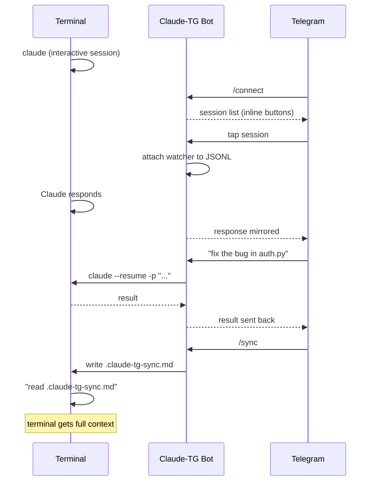

# Claude-TG

Telegram bot for remote control of [Claude Code](https://docs.anthropic.com/en/docs/claude-code) CLI sessions from your phone.

Connect to a running Claude Code terminal session via Telegram, see responses in real-time, send commands remotely, and sync context back when you return to the terminal.

## Features

- **Connect to terminal sessions** — attach to any running Claude Code session with one tap
- **Real-time response mirroring** — Claude's terminal output is forwarded to Telegram automatically
- **Remote command execution** — send prompts from Telegram, Claude executes with full permissions
- **Context sync** — transfer Telegram conversation history back to the terminal via `/sync`
- **Session management** — create, list, stop sessions from Telegram
- **Smart message routing** — replies go to the right session, inline keyboards for disambiguation
- **Auto-registration** — first `/start` auto-registers your `chat_id`

## How It Works



## Quick Start

### 1. Create a Telegram Bot

Open Telegram, find [@BotFather](https://t.me/BotFather), send `/newbot`. Pick a name and username (must end with `bot`). Copy the token.

### 2. Clone and Install

```bash
git clone https://github.com/sawierro/claude-tg.git
cd claude-tg
```

**Windows:**
```
setup.bat
```

**Linux / Mac:**
```bash
chmod +x setup.sh
./setup.sh
```

The setup script creates a virtual environment, installs dependencies, and prompts for your bot token.

### 3. First Launch

```bash
# Windows
start.bat

# Linux / Mac
./start.sh
```

On first launch, send `/start` to your bot in Telegram. It auto-registers your `chat_id` — only you can control the bot after this.

## Usage

### Connect to a Terminal Session

1. Start `claude` in your terminal as usual
2. In Telegram, send `/connect`
3. Tap the session button to attach
4. Claude's responses now mirror to Telegram
5. Send messages to control the session remotely

### Sync Context Back to Terminal

Telegram commands create a separate conversation branch (Claude CLI limitation). To transfer context back:

1. Send `/sync` in Telegram
2. Bot writes `.claude-tg-sync.md` to the project folder
3. In terminal, tell Claude: *"read .claude-tg-sync.md"*

### Commands

| Command | Description |
|---------|-------------|
| `/connect` | List terminal sessions, attach with one tap |
| `/sync` | Write conversation summary to project folder |
| `/new <name> [path] [prompt]` | Create a new Claude session |
| `/sessions` | List active bot sessions |
| `/stop <name>` | Disconnect a session |
| `/cancel` | Kill running Claude process |
| `/help` | Show help |

### Message Routing

- **Reply** to a session message — routes to that session
- **One active session** — messages go there automatically
- **Multiple sessions** — inline keyboard to choose

## Configuration

**`.env`** — secrets (created during setup):
```
TELEGRAM_TOKEN=123456:ABC-...
```

**`config.json`** — settings (auto-created from `config.example.json`):
```json
{
    "allowed_chat_ids": [],
    "default_work_dir": ".",
    "claude_path": "claude",
    "max_message_length": 4000,
    "session_timeout_hours": 24,
    "subprocess_timeout_minutes": 30
}
```

`allowed_chat_ids` is populated automatically on first `/start`.

## Requirements

- Python 3.11+
- [Claude Code CLI](https://docs.anthropic.com/en/docs/claude-code) installed and authenticated
- A Telegram bot token from [@BotFather](https://t.me/BotFather)

## Architecture

```
bot/
├── main.py              # Entry point, polling loop, graceful shutdown
├── config.py            # Config loading (.env + config.json)
├── db.py                # SQLite (aiosqlite), sessions & messages tables
├── telegram_handler.py  # All Telegram commands and message routing
├── session_manager.py   # Session lifecycle, watcher management
├── session_watcher.py   # JSONL file watcher for terminal responses
├── message_formatter.py # MarkdownV2 escaping, message splitting
└── providers/
    ├── base.py          # Abstract CLI provider interface
    ├── claude.py        # Claude Code CLI integration
    └── codex.py         # OpenAI Codex CLI integration
```

## Limitations

- Telegram commands and terminal are separate context branches — use `/sync` to bridge them
- One user per bot instance (designed for personal use)
- Claude CLI must be installed and logged in on the same machine
- Long responses are split at 4000 characters (Telegram limit)
- Terminal session does not see Telegram messages in real-time (CLI limitation)
